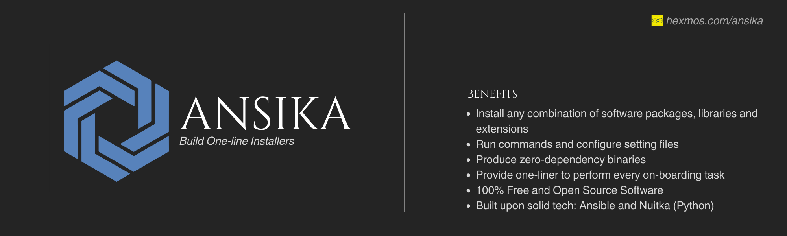

# `Ansika`: One-line Installer for Smoother Employee Onboarding
<div align="center">


[](https://github.com/HexmosTech/Ansika/actions/workflows/build-and-release.yml)
</div>

## Overview

Ansika simplifies bulk software installation tasks, condensing all installation and configuration activities into a single command. It reduces the employee onboarding workload for technical leads and engineers by quickly downloading, authorizing, and executing a binary file. Ansika sets up software,  libraries, and extensions for new employees or interns.

The produced binary has no external dependencies, and requires minimal experience to initiate. One simply has to define software packages, libraries, and settings in the ansible playbook file ([one_installer.yml](https://github.com/HexmosTech/Ansika/blob/main/one_installer.yml)), and push changes to github to get variations of this binary release. The resultant command smoothly downloads, grants permissions, and executes the binary file on local machines.

## Benefits

- Install any combination of software packages, libraries and extensions
- Run commands and configure setting files
- Produce zero-dependency binaries
- Provide one-liner to perform every on-boarding task
- 100% Free and Open Source Software
- Built upon solid tech: Ansible and Nuitka (Python)


## Usage

### Fork the Repository

To create the one-line installer for your team or company, begin by forking this repository.After forking, you can make changes locally to tailor the code or content according to your specific requirements.

### Requirements

- python: Version 2.7 or 3.5 and higher
- Ansible: Version 2.7 or higher (depends on python version installed)
- Nuitka: Version 1.7.5 or higher

### Installing Requirements

- Install Ansible : `pip3 install ansible==8.2.0`
- Install Nuitka : `pip3 install nuitka==1.7.5`
### Modify Ansible Playbook 

 Modify the ansible playbook file in this repository ([one_installer.yml](https://github.com/HexmosTech/Ansika/blob/main/one_installer.yml)) to include additional instructions for installing software packages, tools, extensions, and configurations. For further insights into ansible and ansible playbook, you can refer to the [Ansible documentation](https://docs.ansible.com/ansible/latest/getting_started/index.html).

### Local Testing

You can effortlessly test installation or configuration tasks by executing the binary file within a Docker container locally. We recommend utilizing a Docker container for testing due to its provision of an isolated platform and package independence, ensuring rigorous evaluation of your Ansible installation instructions and binary file. Here's the procedure:

- Begin by pulling the Ubuntu 20.04 image from Docker Hub : 
 ```bash
 docker pull ubuntu:20.04
 ```

- Run an Ubuntu container named `my_ubuntu_container` with an interactive shell, a mounted volume,and start a bash session : 
```bash
docker run -it --name my_ubuntu_container -v ~/Docker_Share:/data ubuntu /bin/bash
```
- The mounted volume facilitates file sharing between the Docker container and the host machine.


#### Ansible Python API

- We executing the ansible playbook file inside the executor.py
- Adjust the playbook file path in the [executor.py](https://github.com/HexmosTech/Ansika/blob/main/executor.py#L47) file.
- You can refer [Ansible Python API](https://docs.ansible.com/ansible/latest/dev_guide/developing_api.html) for more details about the code.

#### Build Binary using Nuitka 

For building the binary file run the command:

```bash

python3 -m nuitka --onefile   --include-package-data=ansible:'*.py' --include-package-data=ansible:'*.yml' --include-data-files=one_installer.yml=one_installer.yml  executor.py
```

The `--include-package-data` option tells Nuitka to include all files that match the specified pattern in the package data of the specified module. In this case, the pattern *.py and *.yml will match all Python files and YAML files in the ansible module.

The `--include-data-files` option tells Nuitka to include the ansible playbook file in the resulting executable. In this case, the file one_installer.yml will be included in the executable.

You may refer to the [Nuitka user manual](https://nuitka.net/doc/user-manual.html) for more information on the available options.

#### Executing binary
First copy the binary file from the host machine to the docker container : 
```bash
sudo cp executor.bin ~/Docker_Share
```

Inside the docker container go to the data directory :
```bash
cd /data
```
Run the executable binary file :
```bash
./executor.bin
```

If you encounter any permission issues run :
```bash
chmod +x executor.bin 
``` 


### Release and Oneline command

Release the binary file and generate a one line command easily using the github actions and workflows.

#### Github Workflow

The github workflow mentioned in the file [build-and-release.yml](./.github/workflows/build-and-release.yml) will handle the binary creation and release of the binary.

- First commit your changes.
- Then create a tag name using the command `git tag v1.0.0`.
- Push the tag `git push v1.0.0`.

If you encounter any permission issues in the workflow follow this steps:

- Go to the repository "Settings".
- After that, it will show you a left pane where you will find "Actions"
- Expand the "Actions" tab
- Click on "General" under the options tab.
- Now on the new page scroll down and you will find "Workflow Permissions"
- Select "Read and Write" under "Workflow Permissions".


#### Binary Release

After the successful completion of the workflow you can see a new release with tag_name in the github releases.

#### One-line Command

Finally, generate the one-line command:

```bash
wget  -q https://github.com/USER/PROJECT/releases/latest/download/executor.bin && chmod +x executor.bin && ./executor.bin
```

replace `USER` and `PROJECT` with github username and repository name.

Share this URL with employees and interns to help them set up the software, tools, and configurations they need for onboarding to your team.

### Blog Post about Ansika

### Acknowledgements
 - Ansible
 - Nuitka